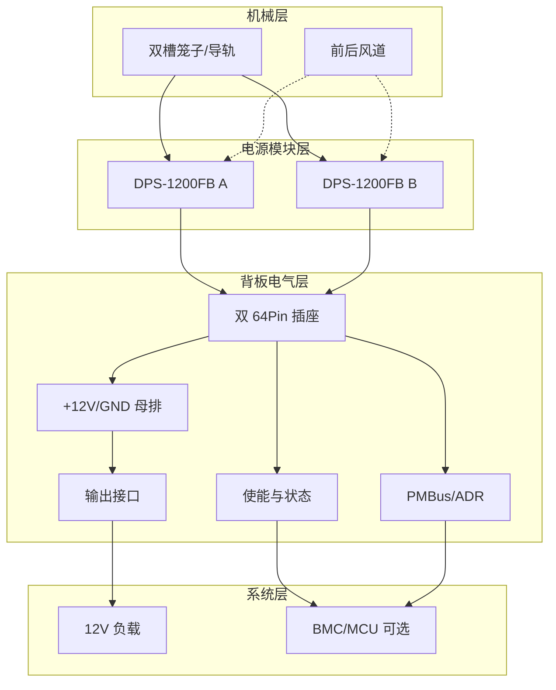

# 01 — 系统架构

## 1. 什么是电源笼子与电源背板

| 部件 | 作用 |
| --- | --- |
| **电源笼子（Power Cage）** | 机械结构：导轨、卡扣、EMI 挡板、进风/出风通道，固定 1–2 只 Common Slot 电源模块，保证热插拔对位 |
| **电源背板（Power Backplane）** | 电气结构：卡槽金手指插座、+12V/GND 母排、使能与状态电路、PMBus、输出端子；把模块输出汇到系统负载 |

二者配合后，才形成服务器里常见的 **双路热插拔电源子系统**。

```text
                  ┌──────────────────────────────────────────┐
   AC IN A ──────►│  PSU A  DPS-1200FB                       │
                  │  (槽位0)                                  │
                  └──────────────┬───────────────────────────┘
                                 │ 64Pin 金手指
                  ┌──────────────▼───────────────────────────┐
   AC IN B ──────►│  PSU B  DPS-1200FB                       │
                  │  (槽位1)                                  │
                  └──────────────┬───────────────────────────┘
                                 │
         ┌───────────────────────▼───────────────────────────┐
         │              电源背板 PCB                          │
         │  · 双卡槽连接器                                    │
         │  · +12V / GND 母排并联                             │
         │  · 每槽 PRE / EN / PSOK / ADR                      │
         │  · 公共 PMBus (SCL/SDA)                            │
         │  · 可选 ORing MOSFET / 保险丝                      │
         │  · 输出铜柱 / 汇流排 / 线缆端子                    │
         └───────────────────────┬───────────────────────────┘
                                 │
                                 ▼
                          系统 12V 负载
                     (主板 / 硬盘背板 / 外设)
```

## 2. 分层架构



### 2.1 机械层

- 槽间距需保证两只模块可独立拔插，互不干涉把手与线缆
- 金手指插座必须与模块插入方向、键位一致，避免反插
- 笼子需接地到机箱大地，形成 EMC/安全地路径
- 出风口应对准模块风扇侧，避免背板阻塞气流

### 2.2 电源模块层

每只 DPS-1200FB 内部已包含：

- EMI 滤波 + PFC
- 主功率变换（常见相移全桥等拓扑）
- 同步整流产生 +12V
- 独立 12VSB 待机电源
- 保护：OVP/OCP/OTP/短路等
- 管理 MCU + EEPROM（I2C）

**背板不要试图“再做一遍 AC-DC”**，只做直流汇流与控制。

### 2.3 背板电气层（本参考设计重点）

建议按功能分区：

1. **功率区**：两槽 `+12V` 并联、`GND` 并联、去耦、可选 ORing、输出端子
2. **控制区**：每槽 `PRE`、`EN`、LED、按键/跳线/MCU GPIO
3. **管理区**：公共 `SCL/SDA`、每槽 `ADR` 编码、上拉、TVS
4. **辅助电源区**：`12VSB` 汇流（可选二极管隔离）→ LDO/DC-DC 给 MCU

### 2.4 系统层

- 纯实验台：跳线使能 + 铜柱输出即可
- 服务器化：BMC/MCU 读 PSOK/ALARM/PMBus，统一 `EN`，上报故障

## 3. 双路工作模式

| 模式 | 行为 | 适用 |
| --- | --- | --- |
| **1+1 冗余（推荐）** | 两路同时在线均流，任一路失效另一路承担全载 | 高可用系统 |
| **主备（Cold / Warm Standby）** | 主路带载，备路只保持 12VSB，故障时使能备路 | 轻载节能 |
| **纯并联扩流** | 两路同时输出，追求更大电流 | 需母排/连接器按合流转设计 |

DPS-1200FB 类 Common Slot 电源通常采用 **Active Droop（主动下垂）均流**：电流增大时输出电压略降（社区报道约数 mV/A 量级），使并联模块自然分担电流。Pin34 `LOAD_SHARE` 可进一步参与均流信息交互；基础并联也可先把两路 `+12V/GND` 直接并到低阻抗母排验证。

## 4. 信号拓扑（双槽）

```text
槽位0 ADR = 默认（ADR 脚悬空/上拉） → EEPROM ~0x57, MCU ~0x5F（社区默认值）
槽位1 ADR = 拉低部分地址脚       → 与槽位0 地址错开

SCL0 ──┬── SCL1 ──► 公共 SCL（上拉到合适逻辑电平）
SDA0 ──┬── SDA1 ──► 公共 SDA

EN0、EN1：独立控制（可并联到同一总使能，也可分槽开关）
PRE0、PRE1：各自经电阻上拉到本槽 12VSB（或经隔离后的 SB 总线）
PSOK0/1、ALARM0/1：分别送 MCU 或 LED
```

> 不同逆向资料对默认 I2C 地址略有出入；以实测为准。关键是 **两槽地址必须不同**。

## 5. 与“单路转接板”的区别

| | 单路 Breakout | 双路笼子背板 |
| --- | --- | --- |
| 目标 | 快速引出 12V | 热插拔 + 冗余/扩流 |
| 连接器 | 1×64Pin | 2×64Pin |
| 使能 | 固定电阻/开关 | 分槽 + 可选统一逻辑 |
| 母排 | 短铜皮即可 | 大电流低阻抗母排 |
| 管理 | 可选 | 几乎必备（地址冲突处理） |
| 机械 | 无 | 笼子/导轨/EMI |

## 6. 推荐实现路径

1. **Rev A**：双槽直并母排 + 分槽 PRE/EN 跳线 + 状态 LED（本仓库默认参考）
2. **Rev B**：增加每槽 ORing MOSFET（如 TPS241x + 低 Rds(on) FET）
3. **Rev C**：加入 MCU（STM32/ESP32 等）做软启动、PMBus 监控、风扇策略、故障闭锁
